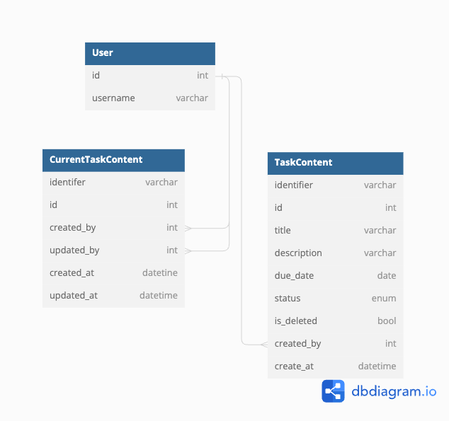

# Task Management

# Why design this way?
1. I can make multiple revision of the task by using `identifier`
2. I have to make trade off table `CurrentTaskContent` to show `updated_by` the latest user with `updated_at` timestamp.

# Step to run the project
1. `docker compose up`. To up and running the `postgres`.
2. `alembic upgrade head`. To apply migration files.
3. `uvicorn main:app --reload`. To run the project.

# Postman collection
[File here](TaskMgmt%20FastAPI.postman_collection.json)

# Diagram.io

# ListView
`filter` and `pagination`
get `/?due_dates__lte=2021-09-01&status=completed&created_by__username=foo&updated_by__username=foo`

# Undo Mechanism
post = make new instance with new `identifier`
put = make new instance with new `identifier`, but reuse the old `id`.
delete = mark as deleted.
post `/undo/<task_id>` = undelete the instance

# Test
Rather than using POSTMAN click. I prefer run the script.
It mutates the database. Then be careful.

You need to add `User` first start with `id=1`.

`python -m unittest`. To run all test cases.
